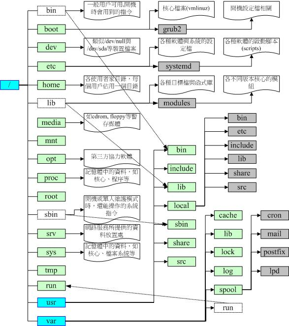

# Linux的文件权限与目录配置

Linux一般将文件可存取身份分为三类，分别是

- owner/group/others

三种身份分别对应为

- read/write/execute

## 使用者与群组 (ugo)

1. 文件拥有者: u

2. 群组: g

3. 其他人: o

4. 所有人: a

**root用户忽略这个权限干啥都行**

- /etc/passwd
  系统中所有用户的密码

- /etc/shadow
  个人密码

- /etc/group
  群组名称记录

## 文件权限

```bash
[cyo57@localhost ~]$ sudo ls -hl
总用量 0
drwxr-xr-x. 2 cyo57 cyo57  6 11月 15 16:01 公共
drwxr-xr-x. 2 cyo57 cyo57  6 11月 15 16:01 模板
```

> 1. 权限
>    - d 代表目录
>
>    - \- 代表文件
>
>    - l 代表链接文件
>
>    - b 代表可随机存取设备
>
>    - c 代表一次性读取设备
>
>    - rwx三位一组，分别代表owner、group、other的r/w/x权限
>
> 2. 链接到此文件的次数
>
> 3. 拥有者
>
> 4. 群组
>
> 5. 容量大小 (Bytes)
>
> 6. 最近修改日期
>
> 7. 文件名
>

### **改变文件属性和权限**

#### chgrp - 改变群组

改变的群组名称必须要在/etc/group文件内存在

`chgrp -R` 递回，即连同目录下的所有文件

#### chown - 改变文件拥有者

`chown binbin file/dir` 将文件所属者修改为binbin

chown也可以使用`chown user.group file` 将会同时修改所属群组

或者使用（推荐）`chown user:group file` 同时修改群组

`[-R` 递回，即连同目录下的所有文件

#### chmod - 改变权限

`chmod a+x file/dir` 所有人可执行

`chmod a-rw file/dir` 所有人不可读写

`-R` 递回，即连同目录下的所有文件

权限对**目录**的重要性

**对目录只有`r`权限，只能读取目录树，无法读取文件。进入目录需要`x`权限**

[例题：假设有个帐号名称为cyo57，他的主文件夹在/home/cyo57/，cyo57对此目录具有`rwx`的权限

```bash
-rwx------ 1 root  root  4365 Sep 19 23:20  the_root.data
```

对此文件来说是cyo57 是 others 的身份，无法rwx。但是此文件在他的主文件夹下，他对此目录具有rwx的权限。因此他可以删除这个文件，但无法打开查看。

假设 cyo57 对某目录拥有 r--，但对某目录下的文件拥有rwx

```bash
drw-r--r--.  2 root  root    32 11月 16 21:30 rootdir
```

```bash
-rwxrwxrwx. 1 root root 12 11月 16 21:29 1.txt
-rwxrwxrwx. 1 root root  9 11月 16 21:30 2.txt
```

尽管cyo57拥有对 `1.txt` 和 `2.txt` 的 `rwx` 权限，但用户缺乏对 `rootdir` 目录的执行权限，**不允许**用户进入该目录，也就无法读取、写入、执行其中的文件了

- 用数字改变文件权限

Linux文件的基本权限只有九个，分别是owner/group/others的read/write/execute权限，缩写为-rwxrwxrwx三个一组。我们也可以使用数字来代表权限

> r:4, w:2, x:1

如果同时拥有`rwx`权限则是7，（因为是二进制的`111`）
如果某文件的权限为`777`则等同于`-rwxrwxrwx`

- 用符号改变文件权限

```bash
| chmod | u g o a | +（加入） -（除去） =（设置） | r w x | 文件或目录 |
```

user, group, others, all

例如设置一个文件权限为`-rwxr-xr-x`
`chmod u=rwx,go=rx file`即可，但需要注意u,go是**连在一起**的，**没有空格**

例如移除全部人的可执行权限：`chmod a-x file`

### 权限的意义

**权限对文件的重要性**

- r : 读取内容，例如文本

- w : 允许编辑、新增或修改（**不含删除**）

- x : 可被系统执行

**权限对目录的重要性**

- r : 读取目录清单（不含文件内容）

- w : 这个权限对目录来说很多

  - 创建文件与目录

  - 删除文件与目录（与目录下**文件本身**的权限无关）

  - 将已存在的文件目录更名

  - 移动文件和目录

- x : 表示能否进入该目录，也就是`cd`到该目录（影响读取目录下的文件内容）

### 文件种类

- 正规文件

  - 纯文本文件 (ASCII)

  - 二进制文件 (binary)
    可执行文件

  - 数据格式文件 (data)
    某些特定格式的文件，例如登录的数据记录在 `/var/log/wtmp` 文件内，用`last`可读，但`cat`会乱码

- 目录 (directory)
  例如`drwxrwxrwx`

- 链接文件 (link)
  例如`lrwxrwxrwx`

- 设备与设备文件 (device)

  - 区块设备文件 (block)
    硬盘和软盘，例如`/dev/sda`

- 字符设备文件 (character)
  串行端口 (COM接口) 的周边设备，例如键盘鼠标，不能截断输出

- 数据接口文件 (sockets)

- 数据输送档 (FIFO, pipe)
  第一个属性为`p`，主要目的是解决多个程序同时存取一个文件造成的错误，全称 first-in-first-out

**Linux的文件拓展名**

Linux的文件能不能执行，与后缀是无关的。只和文件属性有关。

当然我们仍然借拓展名了解文件内容，通常还是会用拓展名表示该文件是什么种种类。常用的拓展名：

- .sh
  脚本和批处理

- Z, tar, tar.gz, zup, tgz
  经过打包的压缩文件，多用于gunzip, tar等等

- .hmtl, .php

文件名只是让你了解该文件可能的用途而已， 真正的执行与否仍然需要权限的规范！例如常见的/bin/ls这个指令，如果这个文件的权限被修改成无法执行时， 那么ls就不能运行了

Linux下传统Ext2/Ext3/Ext4和xfs，文件名长度限制为255Bytes，也就是255个ASCII字符或128汉字

## 目录配置

目前常用Filesystem Hierarchy Standard （FHS）标准

|                              | 可分享的（shareable）        | 不可分享的（unshareable） |
| ---------------------------- | ---------------------------- | ------------------------- |
| 不变的（static）             | /usr （软件放置处）          | /etc （配置文件）         |
| /opt （第三方协力软件）      | /boot （开机与核心档）       |                           |
| 可变动的（variable）         | /var/mail （使用者邮件信箱） | /var/run （程序相关）     |
| /var/spool/news （新闻群组） | /var/lock （程序相关）       |                           |

- / （root, 根目录）：与开机系统有关；
- /usr （unix software resource）：与软件安装/执行有关；
- /var （variable）：与系统运行过程有关。

| 目录                               | 应放置文件内容                                               |
| ---------------------------------- | ------------------------------------------------------------ |
| 第一部份：FHS 要求必须要存在的目录 |                                                              |
| /bin                               | 可执行文件的目录                                             |
| /boot                              | Linux核心文件以及开机菜单与开机所需配置文件等等。            |
| /dev                               | 任何设备与周边设备都是以文件的型态存在于这个目录当中的。存取目录下面的某个文件，就等于存取某个设备 |
| /etc                               | 系统主要的配置文件，例如人员的帐号密码档只有root有权力修改   |
| /lib                               | 开机时会用到的函数库， 以及在/bin或/sbin下面的指令会调用的函数库<br/>必须要存在：/lib/modules/：放置可抽换式的核心相关模块（驱动程序） |
| /media                             | 可移除的设备，包括软盘光盘DVD等等                            |
| /mnt                               | 暂时挂载某些额外设备，建议放置到这个目录                     |
| /opt                               | 第三方协力软件                                               |
| /run                               | 系统开机后所产生的各项信息                                   |
| /sbin                              | 包括开机、修复、还原系统所需要的指令，某些服务器软件程序，一般则放置到/usr/sbin/当中。本机自行安装的软件所产生的系统可执行文件（system binary）放置到/usr/local/sbin/当中了。 |
| /srv                               | “service”的缩写，是一些网络服务启动之后，这些服务所需要取用的数据目录 |
| /tmp                               | 暂时放置文件的地方。 任何人都能够存取                        |
| /usr                               | 第二层 FHS 设置，后续介绍                                    |
| /var                               | 第二层 FHS 设置，主要为放置变动性的数据，后续介绍            |
| 第二部份：FHS 建议可以存在的目录   |                                                              |
| /home                              | 系统默认的使用者主文件<br/>`~`代表目前这个使用者的主文件夹   |
| /lib<qual>                         | 与 /lib 不同的格式的二进制函数库，例如 64 位的 /lib64 函数库等 |
| /root                              | root的主文件夹                                               |

- /usr 的意义 (Unix Software Resource)

| 目录                             | 应放置文件内容                                               |
| -------------------------------- | ------------------------------------------------------------ |
| FHS 要求存在                     |                                                              |
| /usr/bin/                        | 一般用户能够使用的指令                                       |
| /usr/lib/                        | 与 /lib 功能相同， /lib 就是链接到此目录中                   |
| /usr/local/                      | 自行安装的软件                                               |
| /usr/sbin/                       | 目前 /sbin 就是链接到此目录中的                              |
| /usr/share/                      | 主要放置只读架构的数据文件<br/>常见的还有这些次目录：/usr/share/man：线上说明文档 <br>/usr/share/doc：软件杂项的文件说明<br/>/usr/share/zoneinfo：与时区有关的时区文件 |
| 第二部份：FHS 建议可以存在的目录 |                                                              |
| /usr/games/                      | 与游戏比较相关的数据放置处                                   |
| /usr/include/                    | c/c++等语言的（header）与（include）                         |
| /usr/libexec/                    | 不被一般使用者惯用的可执行文件或脚本                         |
| /usr/lib<qual>/                  | 目前 /lib<qual> 就是链接到此目录中                           |
| /usr/src/                        | 一般源代码，src有source的意思。核心源代码则建议放置到/usr/src/linux/ |

- var 的意义

系统运作后才会渐渐占用硬盘，`/var` 主要针对常态性变动的文件，包括 cache, log file以及某些软件运行所产生的lock file, run file。常见的次目录

| 目录             | 应放置文件内容                                               |
| ---------------- | ------------------------------------------------------------ |
| FHS 要求必须存在 |                                                              |
| /var/cache/      | 应用程序本身运行过程中产生的一些暂存盘                       |
| /var/lib/        | 程序执行的过程中使用到的数据文件放置，有各自的目录。 举例，MySQL的数据库放置到/var/lib/mysql/ |
| /var/lock/       | 目前此目录也已经挪到 /run/lock 中                            |
| /var/log/        | 登录文件放置！比较重要的文件如/var/log/messages, /var/log/wtmp（记录登陆者的信息）等。 |
| /var/mail/       | 也被放置到/var/spool/mail/目录中！ 通常这两个目录是互为链接文件啦！ |
| /var/run/        | PID放置在这个目录下，这个目录链接到 /run 去了！              |
| /var/spool/      |                                                              |




# ACL权限

Accesss Control List 访问控制列表。限制用户对文件的访问，ACL是UGO权限的补充。同一个文件可以对不同的用户设置不同权限。

有 ACL 属性的文件在 `ls -l` 会有 + 标识

```bash
[root@cent7 testdir]# ll
总用量 4
-rw-rwxr--+ 1 root root 11 11月 23 18:19 file1.txt
```

## 基本使用

- 设置

> setfacl [option] acl_spec file

例如对用户设置: `setfacl -m u:cyo57:rwx file1`
对组设置: `setfacl -m g:project:rw file1`
对 other 设置要遵循语法: `setfacl -m o::rwx file1`

- 移除全部 ACL

`setfacl -b file`

- 移除某个用户的 ACL

`setfacl -x u:name file`

- 查询

> getfacl file

# 默认权限与隐藏属性

除了`rwx` 基本权限外，在Linux传统的`Ext`文件系统下可以用`chattr`进行设置，以`lsattr`查看，其中最重要的属性就是**不可修改**，即使是文件拥有者也不可修改

## umask 文件默认权限

umask 就是指定目前使用者在创建文件或目录时候的**权限默认值**

- 查看umask

`umask`以数字类型表示，`umask -S` 以符号类型表示。其中`umask`的第一位数就是特殊权限

    [root@localhost ~]# umask
    0022
    [root@localhost ~]# umask -S
    u=rwx,g=rx,o=rx

umask的分数指的是“**默认值**需要**减掉**的权限”。文件默认是`666`，目录默认是`777`，如果文件减去`022(u, g-w, o-w)`也就是`user`没有任何影响，`group`和`others`的权限减去`w`。看起来很像减法但他不是减法！！

- 对文件：`-rw-rw-rw-` -> `-rw-r--r--`

- 对目录：`drwxrwxrwx` -> `drwxr-xr-x`

假如我们要修改`umask`值，直接运行`umask 002`即可，注意运算时是减去字符而不是减去数字。例如`666-003=663` 怎么可能多出来执行权限

## attr 文件隐藏属性

`chattr`指令只能在Ext2/Ext3/Ext4的 Linux 传统文件系统上面完整生效

> +, 增加某一个特殊参数，其他原本存在参数则不动。
> -, 移除某一个特殊参数，其他原本存在参数则不动。
> =, 设置一定，且仅有后面接的参数
>
> A  ：存取时间 atime 将不会改变
> S  ：同步写入磁盘
> a  ：只能增加数据，不能删除也不能修改数据，只有root 才能设置这个属性
> c  ：自动将此文件“压缩”，读取时将会自动解压缩。但是在储存的时候，将会先进行压缩后再储存
> d  ：使该文件（或目录）不会被 dump 备份
> i  ：不能被删除、改名、链接、写入数据。只有 root 能设置此属性
> s  ：当文件设置了 s 属性时，如果这个文件被删除，他将会被完全的移除出这个硬盘空间
> u  ：与 s 相反的，当使用 u 来设置文件时，如果该文件被删除了，则数据内容其实还存在磁盘中，

`lsattr` 来查看隐藏属性

> -a ：显示隐藏文件
> -d ：如果接的是目录，仅列出目录本身的属性
> -R ：连同子目录的数据也一并列出来！

## SUID, SGID, SBIT

除了`rwx`之外还有 `s` 和 `t`权限，例如

```bash
[root@localhost testdir]# ll /tmp/ -d
drwxrwxrwt. 29 root root 4096 11月 18 18:08 /tmp/
```

### Set UID (SUID)

> 使调用文件的用户 **临时** 获得与 **文件所有者** 相同的权限

当 `s` 这个标志出现在**文件拥有者**的 `x` 权限上，例如`-rwsr-xr-x`，就成为Set UID，简称SUID。基本上SUID有这样的限制与功能

- SUID 权限**仅对二进制程序** (binary program) 有效

- **执行者**对于该程序需要具有 `x` 权限

- 仅在执行该程序的过程中有效 (run-time)

- 执行者将拥有该程序拥有者 (owner) 的权限

例如，`/etc/shadow` (存储着用户加密密码) 文件权限为

```bash
[root@localhost testdir]# ll /etc/shadow
----------. 1 root root 1261 11月 15 18:20 /etc/shadow
```

意思是只有root可以读写，但一般用户cyo57输入`passwd` 也可以修改自己的密码，借助上方的说明

1. cyo57 对 `/usr/bin/passwd` 有 `x` 权限

2. `passwd` 的拥有者是 root

3. cyo57 执行 `passwd` 的过程中“暂时”获得 root 权限

4. `/etc/shadow` 可以被 cyo57 执行的 `passwd` 修改

### Set GID (SGID)

> 新创建的文件和子目录将继承父目录的组所有权，而不是继承创建者的组所有权。

当 `s` 这个标志出现在**群组**的 `x` 权限上，例如`-rwx--s--x`，就成为Set UID，简称SUID。基本上SUID有这样的限制与功能

```bash
[root@localhost testdir]# ll /usr/bin/locate 
-rwx--s--x. 1 root slocate 40520 4月  11 2018 /usr/bin/locate
```

与 SUID 不同，SGID可以针对文件或目录进行设置。**对于文件**来说：

- SGID 对二进制程序有效

- 程序执行者对于该程序来说，需要具备 `x` 权限

- 执行者在执行的过程中将会获得该程序群组的支持

例如上面的 `locate` 程序可以搜寻 `/var/lib/mlocate/mlocate.db` 的内容。

除了二进制，SGID 也可以用在目录：

- 使用者对目录有 `rx` 权限时可进入目录

- 使用者在此目录下的有效群组，将变成该目录的群组

- 如果使用者在此目录下具有 `w` 权限，则**使用者创建的文件的群组，与此目录的群组相同，而不是继承创建者**

此权限对于专案开发来说非常重要！

### Sticky Bit (SBIT)

> 只有目录所有者和root能够删除或重命名目录下的文件

`drwxrwxrwt`

只对目录有效，对文件无效

- 当使用者拥有目录的 `wx` 权限

- 当使用者在目录下创建文件或目录，仅有自己与 root 才有权删除文件

也就是说如果 A 目录具有 SBIT 权限，则用户只能针对自己创建的文件或目录进行删除修改移动等操作，无法删除其他人的文件

### 高级权限的设置

> 4, SUID
>
> 2, SGID
>
> 1, SBIT

假设要将 `file1` 权限修改为 `-rwsr-xr-x` ，因为 `s` 在使用者权限中，所以是 SUID，需要在原来的 `755` 前加上4，也就是`chmod 4755 file1`。或者直接`chmod +s file`。此外还会有大写 `S` 和 `T` 的产生，例如：

```bash
[root@localhost testdir]# chmod 7666 file1
[root@localhost testdir]# ll
总用量 0
-rwSrwSrwT. 1 root root 0 11月 19 14:47 file1
```

因为`file1` 的拥有者自身都没有 `x` 权限，怎么可能会有 SUID 权限呢。所以用大写 `S` 表示 SUID 为空权限


# 回顾

- 文件和目录的`rwx` 权限 和 群组
  `chown`, `chgrp`, `chmod`
  `chmod` 的符号法与数字法
  开放浏览目录至少需要`rx`权限，如果目录没有`x`权限，目录下的文件无法读取

- `drwxrwxrwx` 第一位字母的含义

- `.file` 作为隐藏文件

- FHS所定义的三层主目录为：/, /var, /usr三层

