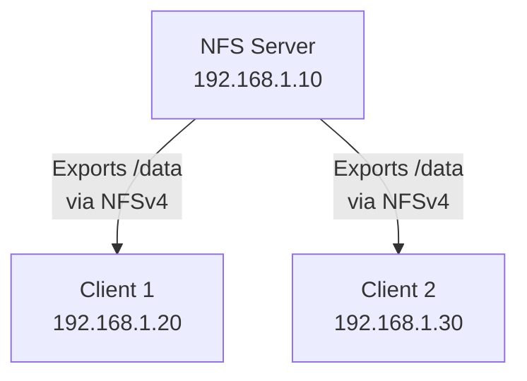
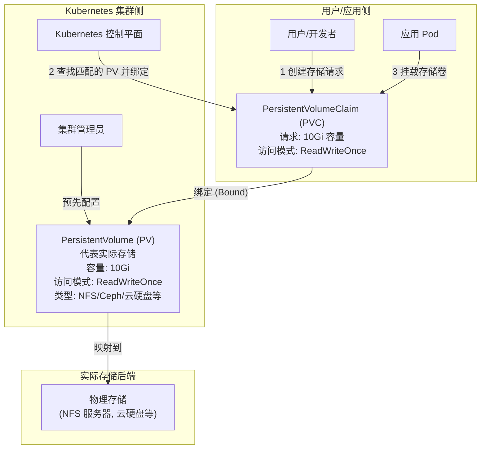

> **Volume (存储卷)** 是用来给 Pod 中的容器提供**持久化或共享存储**的一种机制。
> 
> 容器本身是临时的，重启或删除后数据会丢失。Volume 允许你将数据存储在容器外部，即使容器或 Pod 被销毁重建，数据也能保留下来。
> 同一个 Pod 中的多个容器可以挂载同一个 Volume，方便它们之间共享文件或数据。

## 类型

### emptyDir

- Pod 分配到节点自动时创建，移除时删除
- 数据**不持久化**，与 Pod 生命周期绑定

生成一个 Pod 容器来测试

```shell
kubectl run test-pod-pv --image nginx --dry-run=client -o yaml > test-pod-pv.yaml
```

修改文件，加入 Volume 配置

```yaml
apiVersion: v1
kind: Pod
metadata:
  creationTimestamp: null
  labels:
    run: test-pod-pv
  name: test-pod-pv
spec:
  volumes: # 创建两个 Volume
  - name: volume1
    emptyDir: {} # Volume 类型
  - name: volume2
    emptyDir: {}
  containers:
  - image: nginx
    name: test-pod-pv
    resources: {}
    volumeMounts: # 映射 Volume 到容器
    - name: volume1 # 和 Volume 名字相同
      mountPath: /app/temp-data1 # 容器内路径
  - image: nginx # 这里在一个 Pod 中放两个容器，测试共享 Volume
    name: test-pod-pv2
    command: ["sh","-c","sleep 10000"] # 添加 sleep 否则两个容器抢占 80 导致异常退出
    resources: {}
    volumeMounts: # 映射 Volume 到容器
    - name: volume1 # 和 Volume 名字相同
      mountPath: /app/temp-data2 # 容器内路径
  dnsPolicy: ClusterFirst
  restartPolicy: Always
status: {}
```

应用配置文件

```shell
root@k8smaster:~# kubectl apply -f test-pod-volume.yaml 
pod/test-pod-pv created
root@k8smaster:~# kubectl get po -o wide
NAME          READY   STATUS    RESTARTS   AGE   IP              NODE       NOMINATED NODE   READINESS GATES
test-pod-pv   2/2     Running   0          5s    10.244.249.22   k8snode1   <none>           <none>         <none>
root@k8smaster:~#
root@k8smaster:~# kubectl exec -it test-pod-pv -c test-pod-pv2  -- ls -ahl /app
total 12K
drwxr-xr-x 3 root root 4.0K May  2 15:30 .
drwxr-xr-x 1 root root 4.0K May  2 15:30 ..
drwxrwxrwx 2 root root 4.0K May  2 15:30 temp-data2
root@k8smaster:~# kubectl exec -it test-pod-pv -c test-pod-pv  -- ls -ahl /app
total 12K
drwxr-xr-x 3 root root 4.0K May  2 15:30 .
drwxr-xr-x 1 root root 4.0K May  2 15:30 ..
drwxrwxrwx 2 root root 4.0K May  2 15:30 temp-data1
```


查询 emptyDir 在**对应节点**宿主机的路径，当一个pod中有两个容器时，可以使用-c命令，指定进入一个容器内

```shell
root@k8snode1:~# crictl ps
CONTAINER           IMAGE               CREATED             STATE               NAME                        ATTEMPT             POD ID              POD
d28b88e4c7c19       a830707172e80       7 minutes ago       Running             test-pod-pv                 0                   391d058d5661b       test-pod-pv
root@k8snode1:~# crictl inspect d28b88e4c7c19 | grep mounts -A 10
    "mounts": [
      {
        "containerPath": "/app/temp-data1",
        "gidMappings": [],
        "hostPath": "/var/lib/kubelet/pods/a1e5d4a6-e0a9-4a41-a6b5-a498f7165f0e/volumes/kubernetes.io~empty-dir/volume1",
        "propagation": "PROPAGATION_PRIVATE",
        "readonly": false,
        "selinuxRelabel": false,
        "uidMappings": []
      },
```
### hostPath

- 将**节点宿主系统**中的文件或目录挂载到 Pod 中
- 数据持久化，如果 Pod 被调度到**不同的节点**上，它将访问到**不同**节点上的文件或目录，数据无法同步
- **不推荐**使用，因为降低了 Pod 的可移植性。通常用于需要访问节点特定资源或系统文件的 Pods

`hostPath` 就是直接把节点上的某个路径“映射”到容器里，和 `emptyDir` 来源和**生命周期**是不同的。`emptyDir` 是 Kubelet 在 Pod 调度到节点时**创建**的一个临时目录，随 Pod 消失而消失。`hostPath` 是**使用**节点上**已经存在**的目录或文件。

```shell
kubectl run test-pod-volume2 --image nginx --dry-run=client -o yaml > test-pod-volume2.yaml
```

```yaml
apiVersion: v1
kind: Pod
metadata:
  creationTimestamp: null
  labels:
    run: test-pod-volume2
  name: test-pod-volume2
spec:
  volumes:
  - name: v1
    hostPath:
      path: /data/vol1
  containers:
  - image: nginx
    name: nginx
    resources: {}
    volumeMounts:
    - name: v1
      mountPath: /v1-data
  dnsPolicy: ClusterFirst
  restartPolicy: Always
status: {}
```

### NFS

- 网络文件系统存储卷
- Pod 可以挂载 NFS 共享目录
- **数据持久化**，可以被多个 Pod 同时挂载

> NFS 全称是 **Network File System**，网络文件系统。你可以把它想象成一个“网络共享文件夹”。
> 简单来说，NFS 允许一台电脑（我们叫它 **服务器**）把它的某个文件夹分享出来，让网络上的其他电脑（我们叫它们 **客户端**）可以访问这个文件夹里的文件，就像访问自己电脑里的文件一样方便


#### NFS Server 配置

安装 NFS 服务器和客户端工具

```shell
sudo apt install nfs-kernel-server nfs-common
```

- `nfs-kernel-server`: NFS 服务端核心
- `nfs-common`: NFS 客户端工具（服务端也需要安装）

创建共享目录，并设置权限

```shell
sudo mkdir /nfsdata
vim /etc/exports

exportfs -arv
```

exports
```text
/nfsdata *(rw,async,no_root_squash)
```

- `no_root_squash`： 登入 NFS 主机使用分享目录的使用者，如果写 `root` ，分享的目录就具有 `root` 的权限，极不安全
- `-a`: 全部挂载
- `-r`: 重新挂载
- `-u`: 卸载
- `-v`: 显示共享目录


虽然 Pod 要访问 NFS 目录，但真正连接 NFS 的是 Pod 所在的物理主机，所以 k8snode 需要安装 NFS 客户端

在 node 挂载 NFS 远程目录

```shell
sudo apt-get install nfs-common -y
mount 192.168.100.119:/nfsdata /mnt
```

创建 Pod 进行测试

```yaml
apiVersion: v1
kind: Pod
metadata:
  creationTimestamp: null
  labels:
    run: test-pod-nfs
  name: test-pod-volume-nfs
spec:
  volumes:
  - name: v-nfs
    nfs:
      server: 192.168.100.119
      path: /nfsdata
  containers:
  - image: nginx
    name: nginx
    resources: {}
    volumeMounts:
    - name: v-nfs
      mountPath: /v1-data
  dnsPolicy: ClusterFirst
  restartPolicy: Always
status: {}
```

验证 NFS 是否生效，且 Pod 内为可读写

```shell
root@k8smaster:~# kubectl apply -f test-pod-volume-nfs.yaml 
pod/test-pod-volume-nfs created
root@k8smaster:~# kubectl get po
NAME                  READY   STATUS    RESTARTS   AGE
test-pod-volume-nfs   1/1     Running   0          20s
oot@k8smaster:~# kubectl exec -it test-pod-volume-nfs -- ls -ahl v1-data
total 8.0K
drwxr-xr-x 2 root root 4.0K May  2 15:24 .
drwxr-xr-x 1 root root 4.0K May  2 15:22 ..
-rw-r--r-- 1 root root    0 May  2 15:24 testFile
root@k8smaster:~# ssh root@192.168.100.119 touch /nfsdata/testFile
root@192.168.100.119's password: 
root@k8smaster:~# kubectl exec -it test-pod-volume-nfs -- ls -ahl v1-data
total 8.0K
drwxr-xr-x 2 root root 4.0K May  2 15:24 .
drwxr-xr-x 1 root root 4.0K May  2 15:22 ..
-rw-r--r-- 1 root root    0 May  2 15:24 testFile

root@k8smaster:~# kubectl exec -it test-pod-volume-nfs -- touch /v1-data/pod-create-file
root@k8smaster:~# ssh root@192.168.100.119 ls -ahl /nfsdata/
root@192.168.100.119's password: 
total 8.0K
drwxr-xr-x  2 root root 4.0K May  2 15:26 .
drwxr-xr-x 24 root root 4.0K May  2 14:00 ..
-rw-r--r--  1 root root    0 May  2 15:26 pod-create-file
-rw-r--r--  1 root root    0 May  2 15:24 testFile
```
### CephFS

- pass

### iscsi

- pass


## 持久化存储 PV/PVC

- PersistentVolume (PV)

> 它代表了真实的存储资源，比如一块云硬盘、一个 NFS 共享目录、一个 CephFS 卷等等。PV 是集群级别的资源，不属于任何特定的 Pod。它有自己的生命周期，独立于 Pod。

- PersistentVolumeClaim (PVC)

> 就像是用户（或者说 Pod）向集群**申请存储空间的“订单”或“请求”**。用户不需要关心存储的具体实现细节（是 NFS 还是 CephFS？在哪台服务器上？），只需要说明自己需要多大的空间、什么样的访问模式（比如只读、读写等）。

- PV 和 PVC 的关系

> [!tip]
> PV 是全局可见的，可跨命名空间，而 PVC 不能跨越命名空间
> 
> - 存储单位
> 为了保持一致性并与 Kubernetes 的常见用法对齐，**推荐使用二进制单位 (Gi, Mi 等)** 来定义存储容量。

我会在您的笔记中补充这部分解释。

用户通过创建 PVC 来表达对存储的需求，Kubernetes 会找到一个符合 PVC 要求的 PV，并将它们“绑定”起来。然后，Pod 就可以通过引用这个 PVC 来使用它所绑定的 PV 提供的存储空间了。

PV 是存储资源的提供者，PVC 是存储资源的使用者（请求者）。Pod 通过 PVC 来间接使用 PV 提供的持久化存储。




### PV

PV 持久卷是通过插件实现的，目前支持以下：

- **csi**: 容器存储接口 (Container Storage Interface) 标准的扩展接口
- **nfs**: 网络文件系统 (Network File System)
- **hostPath**: 将宿主机上的文件或目录用作持久存储，通常仅用于单节点测试
- **local**: 本地存储设备，如磁盘、分区等。与 `hostPath` 类似，使用 `local` PV 的 Pod 会被调度到拥有该存储的特定节点。
- **iscsi**: 挂载 iSCSI 存储设备。
- **fc**: Fibre Channel 存储设备。
- **cephfs**: CephFS 文件系统。
- **rbd**: Ceph RADOS 块设备。
- _(以及其他多种存储类型...)_

查看 K8s 文档获取模板
- [文档1](https://kubernetes.io/docs/tasks/configure-pod-container/configure-persistent-volume-storage/)
- [文档2](https://kubernetes.io/docs/concepts/storage/persistent-volumes/)

```yaml
apiVersion: v1
kind: PersistentVolume
metadata:
  name: pv1
spec:
  capacity:
    storage: 5Gi
  volumeMode: Filesystem # 默认值，可不写
  accessModes:
    - ReadWriteOnce
  persistentVolumeReclaimPolicy: Recycle # 不写默认值为 Retain
  storageClassName: manual # 不写默认值为"" (空字符串)
  nfs:
    path: /server_nfs_path
    server: 172.17.0.2
```

- **volumeMode**: (可选) 支持 `Filesystem` 和 `Block`
- **accessModes**: 定义卷的访问模式
    - `ReadWriteOnce`: 被单个节点以读写方式挂载
    - `ReadOnlyMany`: 被多个节点以只读方式挂载
    - `ReadWriteMany`: 被多个节点以读写方式挂载
    - `ReadWriteOncePod`: 被单个 Pod 以读写方式挂载（Kubernetes 1.22+ ）
- **persistentVolumeReclaimPolicy**: 当 PV 被释放（即绑定的 PVC 被删除）后，如何处理底层存储资源：
    - `Retain`: 保留数据，需要手动清理。
    - `Delete`: 删除底层存储资源（取决于存储插件是否支持）。
    - `Recycle`: 清空数据并使 PV 可用（已弃用，推荐使用动态 Provisioning 或 Retain）。
- **storageClassName**: 指定 PV 所属的 [StorageClass](https://kubernetes.io/zh-cn/docs/concepts/storage/storage-classes/) 类
- **mountOptions**: (可选) 挂载卷时使用的额外选项

创建 PV

```shell
root@k8smaster:~# kubectl apply -f pv1.yaml 
persistentvolume/pv1 created
root@k8smaster:~# 
root@k8smaster:~# kubectl get pv -o wide
NAME   CAPACITY   ACCESS MODES   RECLAIM POLICY   STATUS      CLAIM   STORAGECLASS   REASON   AGE   VOLUMEMODE
pv1    5Gi        RWO            Recycle          Available           slow                    6s    Filesystem
```

此时 Claim 为空，因为没有任何关联。

### PVC

复制官方模板

```yaml
apiVersion: v1
kind: PersistentVolumeClaim
metadata:
  name: pvc1
  namespace: default # 默认值
spec:
  storageClassName: manual # 默认值为""
  accessModes:
    - ReadWriteOnce
  resources:
    requests:
      storage: 2Gi
```

- **spec.storageClassName**: 想要绑定的 PV 所属的 StorageClass 名称。如果省略此字段，则会使用默认 StorageClass 动态创建 PV。
- **spec.accessModes**: 定义 PVC 请求的访问模式，必须与匹配的 PV 的访问模式兼容。选项与 PV 的 `accessModes` 相同：
    - `ReadWriteOnce`: 可以被单个节点以读写方式挂载
    - `ReadOnlyMany`: 可以被多个节点以只读方式挂载
    - `ReadWriteMany`: 可以被多个节点以读写方式挂载
    - `ReadWriteOncePod`: 卷可以被单个 Pod 以读写方式挂载（Kubernetes 1.22+ ）
- **spec.resources.requests.storage**: 定义 PVC 请求的存储容量。Kubernetes 会寻找容量不小于此值的 PV 进行绑定。

```shell
root@k8smaster:~# kubectl get pv
NAME   CAPACITY   ACCESS MODES   RECLAIM POLICY   STATUS   CLAIM          STORAGECLASS   REASON   AGE
pv1    5Gi        RWO            Recycle          Bound    default/pvc1   manual                  49m
root@k8smaster:~# kubectl get pvc
NAME   STATUS   VOLUME   CAPACITY   ACCESS MODES   STORAGECLASS   AGE
pvc1   Bound    pv1      5Gi        RWO            manual         73s
```
### 创建 Pod

创建的 Pod 需要和 PVC 在同一个命名空间中

```shell
apiVersion: v1
kind: Pod
metadata:
  name: pod-pvc-test
spec:
  containers:
    - name: nginx
      image: nginx
      imagePullPolicy: IfNotPresent
      volumeMounts:
      - mountPath: "/var/www/html"
        name: mypd
  volumes:
    - name: mypd
      persistentVolumeClaim:
        claimName: pvc1
```

检查读写文件是否正常

```shell
root@k8smaster:~# kubectl get po -o wide
NAME           READY   STATUS    RESTARTS   AGE     IP              NODE       NOMINATED NODE   READINESS GATES
pod-pvc-test   1/1     Running   0          3m57s   10.244.249.27   k8snode1   <none>           <none>
root@k8smaster:~# kubectl exec -it pod-pvc-test -- ls /var/www/html
pod-create-file  testFile
root@k8smaster:~# kubectl exec -it pod-pvc-test -- touch /var/www/html/index.html
root@k8smaster:~# kubectl exec -it pod-pvc-test -- ls /var/www/html
index.html  pod-create-file  testFile
root@k8smaster:~# ssh root@192.168.100.119 ls /nfsdata
root@192.168.100.119's password: 
index.html
pod-create-file
testFile
root@k8smaster:~# 
```

