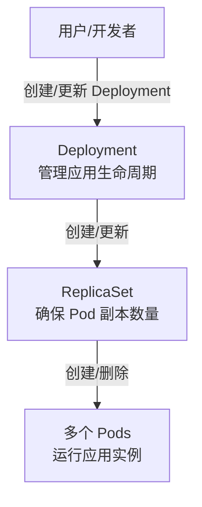

---
tags:
  - k8s
Created: "250503"
Modified:
---
## Delopyment & ReplicaSet & Pod 的关系

> **Deployment (部署)** 是 Kubernetes 中用来管理**无状态应用**的一种控制器。
> 
> 它的主要作用是声明你想要运行多少个 Pod 的副本，以及这些 Pod 应该长什么样（使用哪个镜像、挂载哪些 Volume 等）。Deployment 会确保集群中始终有指定数量的 Pod 在运行，并且能够方便地进行应用的**更新**和**回滚**。
> 
> 简单来说，你告诉 Deployment 你想要什么状态（比如运行 3 个 Nginx Pod），Deployment 就会努力去达到并维持这个状态。


- **Pod**: 最小可部署单元，运行N个容器
- **ReplicaSet**: 确保任何时候都有指定数量的 Pod 副本运行
- **Depolyment**: 更高级别的控制器，管理 ReplicaSet

> [!tip]
> 通常只需要和 Deployment 打交道，而不需要直接创建或管理 ReplicaSet 和 Pod。Deployment 会处理这些底层细节。




### 为什么使用 Deployment

使用 Deployment 可以带来很多好处：

1. **声明式更新**: 修改 Deployment 的 YAML 文件描述新状态（比如更新镜像），Kubernetes 会自动处理
2. **滚动更新 (Rolling Update)**: Deployment 默认的更新策略。逐步用新版本的 Pod 替换旧版本的 Pod，而不是一次性全部替换。保证在更新过程中应用不会中断
3. **回滚 (Rollback)**: 如果新的版本有问题，可以回滚到之前的稳定版本
4. **弹性伸缩**: 通过修改 Deployment 的副本数 (`replicas`)，可以方便地增加或减少运行的应用实例数量
5. **自我修复**: 如果 Pod 崩溃或被删除，Deployment 会通过 ReplicaSet 自动创建新的 Pod 来替代，维持所需的副本数量


### 生成模板

```shell
kubectl create deployment deploy1 --image nginx --dry-run=client -o yaml > deploy1.yaml
```

```yaml
apiVersion: apps/v1
kind: Deployment
metadata:
  creationTimestamp: null
  labels:
    app: deploy1
  name: deploy1
spec:
  replicas: 3
  selector:
    matchLabels:
      app: deploy1
  strategy: {}
  template:
    metadata:
      creationTimestamp: null
      labels:
        app: deploy1
    spec:
      containers:
      - image: nginx
        name: nginx
        resources: {}
status: {}
root@k8smaster:~#
```

- `spec.replicas`: Pod 副本数量。
- `spec.selector`: Pod 的标签选择器。它必须匹配 `spec.template.metadata.labels` 中定义的标签。
- `spec.template`: Deployment 会根据这个模板来创建新的 Pod。
    - `spec.template.metadata.labels`: Pod 将会带有的标签。必须被 `spec.selector` 匹配到。
    - `spec.template.spec`: Pod 的具体规格，比如容器、Volume 等，这部分和直接创建 Pod 的 YAML 类似


同一个 Deploy 创建的 Pod，标签也一致

```shell
root@k8smaster:~# kubectl get po --show-labels 
NAME                       READY   STATUS    RESTARTS   AGE   LABELS
deploy1-67b55d4f9f-j986w   1/1     Running   0          47s   app=deploy1,pod-template-hash=67b55d4f9f
deploy1-67b55d4f9f-m29hd   1/1     Running   0          20s   app=deploy1,pod-template-hash=67b55d4f9f
deploy1-67b55d4f9f-w4spp   1/1     Running   0          20s   app=deploy1,pod-template-hash=67b55d4f9f

root@k8smaster:~# kubectl get deployments.apps  -o wide
NAME      READY   UP-TO-DATE   AVAILABLE   AGE   CONTAINERS   IMAGES   SELECTOR
deploy1   3/3     3            3           96s   nginx        nginx    app=deploy1
```

如果单纯删除 Pod，是没用的，Deploy 会尽量保持副本数量


## Deploy 伸缩

### 通过 kubectl edit

```shell
root@k8smaster:~# kubectl get deployments.apps  -o wide
NAME      READY   UP-TO-DATE   AVAILABLE   AGE    CONTAINERS   IMAGES   SELECTOR
deploy1   3/3     3            3           5m9s   nginx        nginx    app=deploy1
root@k8smaster:~# kubectl edit deployments.apps deploy1 
```

### 通过 CLI

```shell
kubectl scale deployment deploy1 --replicas 5
```

### 通过 YAML

修改原来的 Yaml，并重新 apply

```shell
kubectl apply -f dep1.yaml
```


## Deploy 滚动更新

修改 Deployment YAML 文件中的 Pod 模板部分，比如更新镜像版本：

```yaml
apiVersion: apps/v1
kind: Deployment
metadata:
  creationTimestamp: null
  labels:
    app: deploy1
  name: deploy1
spec:
  replicas: 3
  selector:
    matchLabels:
      app: deploy1
  strategy: {}
  template:
    metadata:
      creationTimestamp: null
      labels:
        app: deploy1
    spec:
      containers:
      - image: nginx:1.16.1 # 修改版本号
        name: nginx
        resources: {}
status: {}
```

再次 apply 文件，并观察更新

```shell
kubectl apply -f nginx-deployment.yaml
kubectl rollout status deployment/deploy1

root@k8smaster:~# kubectl rollout status deployment/deploy1 
Waiting for deployment "deploy1" rollout to finish: 1 out of 3 new replicas have been updated...

```

### Deploy 回滚

如果更新后的版本有问题，可以回滚到上一个版本

```shell
kubectl rollout undo deployment/deploy1
```

也可以查看历史版本，并回滚指定的版本

```shell
root@k8smaster:~# kubectl rollout history deployment/deploy1 
deployment.apps/deploy1 
REVISION  CHANGE-CAUSE
1         <none>
2         <none>

deployment/nginx-deployment --to-revision=<revision-number>
```

### 通过 set image 更新镜像

这种方式更直接，也同样会触发滚动更新。

```shell
kubectl set image deployment/deploy1 nginx=nginx:1.17.0
```

执行这个命令后，Kubernetes 会自动修改 Deployment 的 Pod 模板，并启动滚动更新过程，逐步替换旧版本的 Pod。

## 动态扩展 HPA

> HPA (Horizontal Pod Autoscaler) 就是 Kubernetes 里的一个“自动伸缩器”。
> 它的主要工作是：**根据你的应用当前的负载情况，自动帮你增加或减少运行中的 Pod 数量。**

HPA 的核心就是：**根据指标，自动调整 Pod 数量，以应对负载变化。** 

> [!warning]
> HPA 是通过 metric service 组件进行检测的，需要提前进行安装 [[1.2 Namespace 和 Pod#metrics-server]]
> 检查命令 `kubectl top pod`


### 通过 CLI

`kubectl autoscale deployment <deployName> --min 1 --max 6`

查看之前创建的一个 Deployment

```shell
root@k8smaster:~# kubectl get po -o wide
NAME                       READY   STATUS    RESTARTS      AGE   IP               NODE       NOMINATED NODE   READINESS GATES
deploy1-688964868b-655bg   1/1     Running   1 (61m ago)   21h   10.244.249.36    k8snode1   <none>           <none>
deploy1-688964868b-bwk92   1/1     Running   1 (61m ago)   21h   10.244.249.37    k8snode1   <none>           <none>
deploy1-688964868b-dt7sv   1/1     Running   1 (61m ago)   21h   10.244.185.212   k8snode2   <none>           <none>
root@k8smaster:~# kubectl get deploy -o wide
NAME      READY   UP-TO-DATE   AVAILABLE   AGE   CONTAINERS   IMAGES         SELECTOR
deploy1   3/3     3            3           21h   nginx        nginx:1.16.1   app=deploy1
root@k8smaster:~# 
```

设置并查看 HPA 状态

```
root@k8smaster:~# kubectl autoscale deployment deploy1 --min 1 --max 6
root@k8smaster:~# kubectl get hpa
NAME      REFERENCE            TARGETS         MINPODS   MAXPODS   REPLICAS   AGE
deploy1   Deployment/deploy1   <unknown>/80%   1         6         3          4m52s
```

- `TARGETS`: 监控指标和触发伸缩的阈值
- `REPLICAS`: 当前 Pod 副本数量

> [!tip]
> 当 HPA 的目标是 CPU 使用率的**百分比**（例如你设置的 `80%`）时，它需要知道 Pod 的 CPU **资源请求**值
> 
> 因为 `resources.requests.cpu` 没有设置，HPA 就无法进行这个计算，所以 `kubectl get hpa` 显示 `TARGETS` 为 `<unknown>/80%`。

需要在 yaml 中添加

```yaml
# ...
spec:
  template:
    spec:
      containers:
      - image: nginx # 或者 nginx:1.16.1
        name: nginx
        resources:
          requests: # <-- 添加 requests
            cpu: "100m" # 例如，请求 100 毫核 CPU
            # memory: "100Mi" # 也可以加上内存请求

```

再次查看 HPA，已经可以正常检测容器资源状态，并且自动进行 HPA 管理

```shell
root@k8smaster:~# kubectl get hpa
NAME      REFERENCE            TARGETS   MINPODS   MAXPODS   REPLICAS   AGE
deploy1   Deployment/deploy1   0%/80%    1         6         3          26m
root@k8smaster:~# 
root@k8smaster:~# 
root@k8smaster:~# kubectl get hpa
NAME      REFERENCE            TARGETS   MINPODS   MAXPODS   REPLICAS   AGE
deploy1   Deployment/deploy1   0%/80%    1         6         1          27m
root@k8smaster:~# 
```

### 测试 HPA 生效

我们进入容器中，消耗大量 CPU

```shell
root@k8smaster:~# kubectl get deploy
NAME      READY   UP-TO-DATE   AVAILABLE   AGE
deploy1   1/1     1            1           22h
root@k8smaster:~# kubectl get po
NAME                       READY   STATUS    RESTARTS   AGE
deploy1-6d687bfd4c-4l5j8   1/1     Running   0          4m4s
root@k8smaster:~# kubectl exec -it deploy1-6d687bfd4c-4l5j8 -- bash
root@deploy1-6d687bfd4c-4l5j8:/# cat /dev/zero > /dev/null &
[1] 13
root@deploy1-6d687bfd4c-4l5j8:/# cat /dev/zero > /dev/null &
[2] 14
root@deploy1-6d687bfd4c-4l5j8:/# cat /dev/zero > /dev/null &
[3] 15
```

观察 Deploy 状态

```shell
root@k8smaster:~# kubectl get po
NAME                       READY   STATUS              RESTARTS   AGE
deploy1-6d687bfd4c-4l5j8   1/1     Running             0          5m16s
deploy1-6d687bfd4c-bmx86   0/1     ContainerCreating   0          2s
deploy1-6d687bfd4c-kttkm   1/1     Running             0          17s
deploy1-6d687bfd4c-lh8xg   1/1     Running             0          17s
deploy1-6d687bfd4c-r5b5k   0/1     ContainerCreating   0          2s
deploy1-6d687bfd4c-td6zx   1/1     Running             0          17s
root@k8smaster:~# kubectl top po
NAME                       CPU(cores)   MEMORY(bytes)   
deploy1-6d687bfd4c-4l5j8   1550m        4Mi             
deploy1-6d687bfd4c-bmx86   4m           1Mi             
deploy1-6d687bfd4c-kttkm   0m           1Mi             
deploy1-6d687bfd4c-lh8xg   0m           1Mi             
deploy1-6d687bfd4c-r5b5k   3m           1Mi             
deploy1-6d687bfd4c-td6zx   0m           1Mi        
root@k8smaster:~# kubectl get deploy
NAME      READY   UP-TO-DATE   AVAILABLE   AGE
deploy1   6/6     6            6           22h
```

不过此时虽然创建了很多 Pod，但仍然是单个 Pod 占用很高，一核有难，9核围观


#### 外部访问压力测试

为 Deploy 创建一个 Service，类型为 NodePort

查看帮助

```shell
root@k8smaster:~# kubectl expose --help |grep dep

 Looks up a deployment, service, replica set, replication controller or pod by name and uses the selector for that resource as the selector for a new service on the specified port. A deployment or replica set will be exposed as a service only if its selector is convertible to a selector that service supports, i.e. when the selector contains only the matchLabels component. Note that if no port is specified via --port and the exposed resource has multiple ports, all will be re-used by the new service. Also if no labels are specified, the new service will re-use the labels from the resource it exposes.
 pod (po), service (svc), replicationcontroller (rc), deployment (deploy), replicaset (rs)
  # Create a service for an nginx deployment, which serves on port 80 and connects to the containers on port 8000
  kubectl expose deployment nginx --port=80 --target-port=8000
```

开放端口并使用浏览器访问测试 (集群任意节点IP即可)

```shell
root@k8smaster:~# kubectl expose deployment deploy1 --port=80 --target-port=80 --type=NodePort
service/deploy1 exposed
root@k8smaster:~# kubectl get service
NAME         TYPE        CLUSTER-IP     EXTERNAL-IP   PORT(S)        AGE
deploy1      NodePort    10.103.3.230   <none>        80:30196/TCP   4s
kubernetes   ClusterIP   10.96.0.1      <none>        443/TCP        3d7h
root@k8smaster:~# 
```