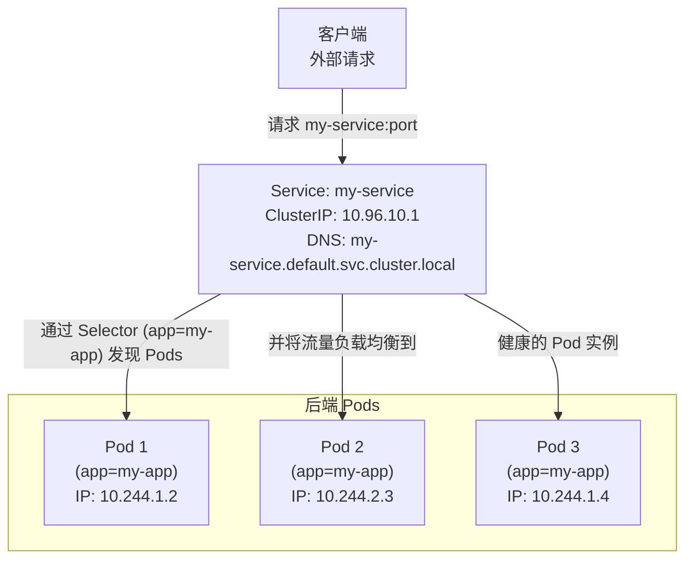

---
tags:
  - k8s
Created: "250507"
---

> **Service (服务)** 是 Kubernetes 中一种核心的**抽象**，它为一组逻辑上相关的 **Pods** (通常由 [[1.4 Deployment]] 或 StatefulSet 管理) 定义了一个统一的访问入口和访问策略，并使用**标签选择器 (Label Selector)** 来确定哪些 Pods 属于这个服务。
>
> 在 Kubernetes 集群中，Pod 是短暂的，它们的 IP 地址会随着创建、销毁和重启而动态变化。如果应用直接依赖于某个 Pod 的 IP 地址，那么当该 Pod 发生变化时，连接就会中断。
> 
> Service 的主要作用就是解决这个问题：它提供了一个**稳定**的 IP 地址（称为 ClusterIP）和 DNS 名称，客户端只需要连接到 Service，Service 就会自动将请求**路由**和**负载均衡**到后端健康的、标签匹配的 Pod 实例上。这使得应用的各个组件之间可以松耦合地进行通信。

## 核心功能

Service 的引入为 Kubernetes 环境下的应用提供了以下关键能力：

1.  **稳定的访问入口 (Stable Access Endpoint):**
    *   每个 Service 都会被分配一个集群内部唯一的虚拟 IP 地址（ClusterIP），以及一个对应的 DNS 名称 (例如 `my-service.my-namespace.svc.cluster.local`)。
    *   无论后端的 Pod 如何变化（伸缩、更新、故障重启导致 IP 改变），Service 的 ClusterIP 和 DNS 名称保持不变，为客户端提供了稳定的访问点。

2.  **服务发现 (Service Discovery):**
    *   Kubernetes 集群内部集成了 DNS 服务 (通常是 CoreDNS)。当 Service 创建时，会自动为其注册 DNS 条目。
    *   集群内的其他 Pod 可以通过 Service 的 DNS 名称轻松发现并连接到目标服务，无需硬编码 IP 地址。

3.  **负载均衡 (Load Balancing):**
    *   Service 能够自动将其接收到的网络请求分发到后端所有匹配标签选择器的健康 Pod 实例上。
    *   默认情况下，Service 使用轮询 (round-robin) 或随机策略进行负载均衡。这有助于分散流量，提高应用的整体吞吐量和可用性。

4.  **解耦 (Decoupling):**
    *   Service 将客户端与后端 Pod 的具体实现细节解耦。客户端只需要知道 Service 的地址，而无需关心后端有多少个 Pod 副本、它们的具体 IP 是什么、或者它们是如何部署和管理的。
    *   这种解耦简化了应用的架构，使得后端服务的升级、伸缩和维护对客户端透明。



> [!tip]
> Service 主要关注的是 OSI 模型中的第 4 层（传输层，TCP/UDP）。对于更复杂的路由需求（如基于 HTTP 路径的路由），通常会使用 ingress

### Pod 开放端口

直接创建的 Pod 没有对外开放端口，只能集群内部访问，进行测试

```shell
root@k8smaster:~# kubectl run nginx-pod1 --image nginx
pod/nginx-pod1 created
root@k8smaster:~# kubectl get po -o wide
NAME         READY   STATUS    RESTARTS   AGE   IP              NODE       NOMINATED NODE   READINESS GATES
nginx-pod1   1/1     Running   0          19s   10.244.249.61   k8snode1   <none>           <none>
root@k8smaster:~# 
```

这里 `10.244.249.61` 是内网IP，只有集群内部可以访问（通过 `calico` 网络）。

我们可以对 Pod 做端口映射，类似于 `docker -p` 那样 **（该方法仅测试环境使用)**

```shell
kubectl run nginx-pod-port --image nginx --port 80 --dry-run=client -o yaml > pod-port.yaml
```

编辑配置文件

```yaml
apiVersion: v1
kind: Pod
metadata:
  creationTimestamp: null
  labels:
    run: nginx-pod-port
  name: nginx-pod-port
spec:
  containers:
  - image: nginx
    name: nginx-pod-port
    ports:
    - containerPort: 80
      hostPort: 8080 # 这一行手动添加
    resources: {}
  dnsPolicy: ClusterFirst
  restartPolicy: Always
status: {}
```

应用配置文件

```shell
root@k8smaster:~# kubectl apply -f pod-port.yaml 
pod/nginx-pod-port created
root@k8smaster:~# kubectl get po -o wide
NAME             READY   STATUS    RESTARTS   AGE   IP              NODE       NOMINATED NODE   READINESS GATES
nginx-pod-port   1/1     Running   0          3s    10.244.249.63   k8snode1   <none>           <none>
root@k8smaster:~# 
```

该 Pod 目前运行在 node1，外部可以通过 `nodeIP:8080` 进行访问。因为添加的 `hostPort` 会修改 `iptables` 的规则

```shell
root@k8snode1:~# iptables -S -t nat |grep '8080 -j'
-A CNI-DN-26cd3e4d7bd8914fb26d5 -s 10.244.249.63/32 -p tcp -m tcp --dport 8080 -j CNI-HOSTPORT-SETMARK
-A CNI-DN-26cd3e4d7bd8914fb26d5 -s 127.0.0.1/32 -p tcp -m tcp --dport 8080 -j CNI-HOSTPORT-SETMARK
-A CNI-DN-26cd3e4d7bd8914fb26d5 -p tcp -m tcp --dport 8080 -j DNAT --to-destination 10.244.249.63:80
-A CNI-HOSTPORT-DNAT -p tcp -m comment --comment "dnat name: \"k8s-pod-network\" id: \"af7f44f5ecd83a86692feced3d25219d03a1196759f8e6592794e6a52f5baed7\"" -m multiport --dports 8080 -j CNI-DN-26cd3e4d7bd8914fb26d5
root@k8snode1:~# 
```

> [!WARNING]
> 这种方法在实际应用中会带来一系列问题：
> - 端口冲突
> 	- `hostPort` 在主机节点上是唯一的，其他 Pod 都会因为端口占用而无法启动
> - 调度限制
> 	- 调度器必须确保 `hostPort` 在节点是可用的，如果无法调度则一直处于 `Pending`
> - 单点故障风险
> - 缺乏负载均衡
> - 管理复杂度增加
> - 不符合声明式模型


### 为什么需要 Service

1. **Pod 的动态性**：Pod 的 IP 地址不是固定的。当 Pod 重启、扩缩容或更新时，其 IP 地址可能会改变。如果客户端直接连接 Pod IP，连接会变得不可靠。
2. **负载均衡**：当有多个 Pod 副本提供相同服务时，Service 可以将请求分发到这些 Pod 上，实现负载均衡。
3. **服务发现**：Service 提供了 DNS 名称，使得集群内的其他应用可以通过一个固定的名称来发现和访问服务，而无需关心后端 Pod 的具体 IP。

### ClusterIP

> **ClusterIP** 是 Kubernetes Service 的默认类型。它为 Service 分配一个**集群内部的虚拟 IP 地址**。这个 IP 地址只能在集群内部访问，集群外部无法直接访问。
> 
> ClusterIP 类型的 Service 主要用于集群内部应用之间的通信。

#### 特点

- **内部访问**：只能从集群内访问
- **虚拟IP**：IP是虚拟的，由 `kube-proxy` 在每个节点通过 `iptables` 或 `ipvs` 实现
- **自动负载均衡**
- **DNS解析**：会为 ClusterIP Service 创建 DNS A 记录，集群内可以通过服务名访问。格式：`service-name>.<namespace-name>.svc.cluster.local`

Service SVC 是通过标签来查找 pod 的，svc 是负载均衡器，后端的 pod 叫 real server (endpoint)

pod 是通过 deploy 管理的，同一个 deploy 创建的 pod 其标签也是一样的

#### 创建

先创建一个 Deploy，使用 Nginx 镜像测试。为了便于体现 SVC 的负载均衡，我们还要修改不同 pod 中的 index.html

```shell
root@k8smaster:~# kubectl create deployment dep-nginx --image nginx --replicas 3 --dry-run=client -o yaml > deploy-nginx.yaml
root@k8smaster:~# kubectl apply -f deploy-nginx.yaml 
deployment.apps/dep-nginx created
root@k8smaster:~# kubectl get po -o wide
NAME                         READY   STATUS    RESTARTS   AGE   IP               NODE       NOMINATED NODE   READINESS GATES
dep-nginx-594479975c-g7d46   1/1     Running   0          4s    10.244.249.6     k8snode1   <none>           <none>
dep-nginx-594479975c-s7ksx   1/1     Running   0          4s    10.244.249.1     k8snode1   <none>           <none>
dep-nginx-594479975c-z2z4m   1/1     Running   0          4s    10.244.185.237   k8snode2   <none>           <none>
root@k8smaster:~# kubectl get deployments.apps 
NAME        READY   UP-TO-DATE   AVAILABLE   AGE
dep-nginx   3/3     3            3           8m7s
###
# 修改 Nginx Index.html 省略
###
```

创建 SVC

```shell
root@k8smaster:~# kubectl expose deployment dep-nginx --name svc-nginx --port 8080 --target-port 80 --dry-run=client -o yaml > svc-nginx.yaml
root@k8smaster:~# kubectl apply -f svc-nginx.yaml 
service/svc-nginx created
root@k8smaster:~# kubectl get service -o wide
NAME         TYPE        CLUSTER-IP      EXTERNAL-IP   PORT(S)    AGE    SELECTOR
kubernetes   ClusterIP   10.96.0.1       <none>        443/TCP    7d3h   <none>
svc-nginx    ClusterIP   10.101.224.72   <none>        8080/TCP   10m    app=dep-nginx
```

> [!tip]
> SVC 是通过 `SELECTOR` 来选择 `Pod` 进行路由的
> ```shell
> root@k8smaster:~# kubectl get po -l app=dep-nginx
> NAME                         READY   STATUS    RESTARTS   AGE
> dep-nginx-594479975c-g7d46   1/1     Running   0          19m
> dep-nginx-594479975c-s7ksx   1/1     Running   0          19m
> dep-nginx-594479975c-z2z4m   1/1     Running   0          19m
> ```
> 也就是说，手动创建一个带标签 [[1.2 Namespace 和 Pod#标签 Label]] 的 `Pod`，也会被 SVC 识别。
> 可以通过命令 `kubectl get endpoints -o yaml` 查看


```yaml
apiVersion: v1
kind: Service
metadata:
  creationTimestamp: null
  labels:
    app: dep-nginx
  name: svc-nginx
spec:
  ports:
  - port: 8080
    protocol: TCP
    targetPort: 80
  selector:
    app: dep-nginx
status:
  loadBalancer: {}
```

- **port**: SVC 对外暴露的端口
- **targetPort**: 实际 Pod 内部的端口

进行测试（负载均衡）

```shell
root@k8smaster:~# kubectl get svc
NAME         TYPE        CLUSTER-IP      EXTERNAL-IP   PORT(S)    AGE
kubernetes   ClusterIP   10.96.0.1       <none>        443/TCP    7d3h
svc-nginx    ClusterIP   10.101.224.72   <none>        8080/TCP   3m2s
root@k8smaster:~# curl 10.101.224.72:8080
Pod3
root@k8smaster:~# curl 10.101.224.72:8080
Pod2
root@k8smaster:~# curl 10.101.224.72:8080
Pod3
root@k8smaster:~# curl 10.101.224.72:8080
Pod1
root@k8smaster:~# curl 10.101.224.72:8080
Pod2
###
# 不同的节点都可访问
###
root@k8snode1:~# curl 10.101.224.72:8080
Pod1
root@k8snode1:~# curl 10.101.224.72:8080
Pod2
```

### Service Type

- ClusterIP (默认)
	- 集群内的虚拟地址
- NodePort
	- 允许集群外部访问 Service，通常用于开发、测试
- LoadBalance
	- 在云环境中直接暴露 Service 到公网
- ExternalName

>[!tip]
>除了上述 Service 类型，还可以通过 Ingress 资源实现更复杂的七层路由

### NodePort

#### 创建

```shell
kubectl expose deployment dep-nginx --name=svc-nginx-np --type="NodePort" --port=8081 --target-port=80
```

```shell
kubectl expose deployment dep-nginx --name=svc-nginx-np --type="NodePort" --port=8081 --target-port=80 --dry-run=client -o yaml > svc-nginx-np.yaml

kubectl apply -f svc-nginx-np.yaml
```

#### 修改 ClusterIP 为 NodePort

```shell
kubectl edit svc xxx
```

修改 spec.type 为 `NodePort`，并在 spec.ports 中添加 `nodePort: 31111`


### LoadBalance

> **LoadBalancer** 类型的 Service 是为了在**云环境**中直接将 Service 暴露到公网而设计的。
> 
> 在支持 LoadBalancer Service 的云提供商（如 AWS, GCP, Azure, 阿里云, 腾讯云等）上创建这种类型的 Service 时，Kubernetes 会自动与云提供商的负载均衡服务集成，创建一个外部负载均衡器，并将外部流量路由到 Service 后端的 Pods。

#### 特点

- **外部访问**：允许集群外部通过公网 IP 访问 Service
- **云集成**：依赖于云提供商的基础设施
- **自动配置**：云提供商自动分配外部 IP 地址，并配置负载均衡器将流量转发到集群的 NodePort 上
- **负载均衡**：由云提供商的负载均衡器和 K8s Service 共同完成对 Pod 的流量分发

#### 何时使用

- 需要在云环境中将服务暴露给外部用户
- 需要云提供商管理的外部负载均衡器时


## Ingress

> 用来管理集群外部如何访问内部 **Service** 的一种方式，特别针对 HTTP 和 HTTPS 流量。

### 裸金属负载均衡器

> 在非公共云环境（如自建机房、VMware等）使用 LoadBalance 时，Kubernetes 控制平面会发出一个请求（“给我一个外部 IP”），但没有任何组件能够响应这个请求，将实际的外部 IP 填充进去。因此，`EXTERNAL-IP` 字段就一直保持在 `<pending>` 状态。

**全部节点**提前准备镜像

```shell
crictl pull quay.io/metallb/controller:v0.14.9
crictl pull quay.io/metallb/speaker:v0.14.9
```

下载 metalLB 声明文件 [Github](https://raw.githubusercontent.com/metallb/metallb/refs/tags/v0.14.9/config/manifests/metallb-native.yaml) 并应用

> [!error]
> 应用 MetalLB v0.14.9 的 YAML 时出现报错，因此转而尝试 v0.13.9 版本并成功。
> 
> ```shell
> kubectl apply -f https://raw.githubusercontent.com/metallb/metallb/v0.13.9/config/manifests/metallb-native.yaml
> ```
 
```shell
root@k8smaster:~# kubectl apply -f metallb-native.yaml 
root@k8smaster:~# 

root@k8smaster:~# kubectl get ns
NAME               STATUS   AGE
calico-apiserver   Active   7d23h
calico-system      Active   7d23h
default            Active   7d23h
kube-node-lease    Active   7d23h
kube-public        Active   7d23h
kube-system        Active   7d23h
metallb-system     Active   3m7s
tigera-operator    Active   7d23h
root@k8smaster:~# 
root@k8smaster:~# kubectl get po -o wide -n metallb-system 
NAME                          READY   STATUS    RESTARTS   AGE     IP                NODE        NOMINATED NODE   READINESS GATES
controller-6db6d84dc7-5vhnv   1/1     Running   0          2m42s   10.244.185.242    k8snode2    <none>           <none>
speaker-chgqh                 1/1     Running   0          2m42s   192.168.100.112   k8snode2    <none>           <none>
speaker-ckkhs                 1/1     Running   0          2m42s   192.168.100.111   k8snode1    <none>           <none>
speaker-zj6mq                 1/1     Running   0          2m42s   192.168.100.110   k8smaster   <none>           <none>
```

检查 Namespace 和 Pods 状态

#### 创建地址池

当前 Master 节点 IP 为 `192.168.100.110`，计算 IP 子网

创建地址池 `pools.yaml`

```yaml
apiVersion: metallb.io/v1beta1
kind: IPAddressPool
metadata:
  name: first-pool
  namespace: metallb-system
spec:
  addresses:
  - 192.168.100.120-192.168.100.140
```

#### 创建实例绑定地址池

l2ad.yaml
```yaml
apiVersion: metallb.io/v1beta1
kind: L2Advertisement
metadata:
  name: example
  namespace: metallb-system
spec:
  ipAddressPools:
  - first-pool
```

检查资源

```shell        
root@k8smaster:~# kubectl apply -f pools.yaml 
ipaddresspool.metallb.io/first-pool created
root@k8smaster:~# kubectl apply -f l2ad.yaml 
l2advertisement.metallb.io/example created
root@k8smaster:~# kubectl get ipaddresspools.metallb.io -n metallb-system 
NAME         AUTO ASSIGN   AVOID BUGGY IPS   ADDRESSES
first-pool   true          false             ["192.168.100.120-192.168.100.140"]
root@k8smaster:~# 
```

#### 创建 SVC

创建一个 Deploy/Nginx 以及 SVC

```shell
root@k8smaster:~# kubectl apply -f deploy-nginx.yaml 
deployment.apps/dep-nginx created
root@k8smaster:~# kubectl expose --name svc-dep-nginx deployment dep-nginx --port 80 --target-port 80 --type LoadBalancer
service/svc-dep-nginx exposed
root@k8smaster:~# kubectl get svc
NAME            TYPE           CLUSTER-IP       EXTERNAL-IP       PORT(S)          AGE
kubernetes      ClusterIP      10.96.0.1        <none>            443/TCP          8d
svc-dep-nginx   LoadBalancer   10.98.25.17      192.168.100.120   80:31242/TCP     3m10s
svc-nginx       NodePort       10.101.224.72    <none>            8080:31111/TCP   20h
svc-nginx1      ClusterIP      10.107.134.38    <none>            80/TCP           17h
svc-nginx2      ClusterIP      10.106.105.250   <none>            80/TCP           17h
svc-nginx3      ClusterIP      10.96.99.125     <none>            80/TCP           17h
root@k8smaster:~# 
```

### 为什么需要 Ingress

Ingress 是集群的流量入口，可以根据定义规则（例如 HOST 或 URL Path）将外部请求路由到不同的 Service

Service 的 NodePort 和 LoadBalancer 类型虽然能暴露服务，但对于复杂的 Web 应用来说不够灵活。Ingress 提供了更高级的功能：

- **统一入口**
- **灵活路由**
- **SSL终止**：可以在 Ingress 层处理 HTTPS 加解密，减轻后端应用负担

### 安装 Ingress

常见的 Ingress Controller 有 Nginx Ingress Controller、Traefik 等

这里安装 [Nginx Ingress Controller](https://github.com/kubernetes/ingress-nginx/tree/controller-v1.12.2)

YAML 下载[链接](https://github.com/kubernetes/ingress-nginx/raw/refs/tags/controller-v1.12.2/deploy/static/provider/cloud/deploy.yaml)

镜像源这里使用 `m.daocloud.io` （添加前缀）

拉取完成后会看到新的 NS, SVC, Pod, Deploy

```shell
root@k8smaster:~# kubectl apply -f deploy-ingress-daocloud.yaml

root@k8smaster:~# kubectl get ns
NAME               STATUS   AGE
calico-apiserver   Active   7d6h
calico-system      Active   7d6h
default            Active   7d6h
ingress-nginx      Active   2m1s
kube-node-lease    Active   7d6h
kube-public        Active   7d6h
kube-system        Active   7d6h
tigera-operator    Active   7d6h

root@k8smaster:~# kubectl get po -n ingress-nginx -o wide
NAME                                       READY   STATUS      RESTARTS   AGE     IP               NODE       NOMINATED NODE   READINESS GATES
ingress-nginx-admission-create-xtfhm       0/1     Completed   0          3m44s   10.244.249.8     k8snode1   <none>           <none>
ingress-nginx-admission-patch-jbwzn        0/1     Completed   0          3m44s   10.244.249.9     k8snode1   <none>           <none>
ingress-nginx-controller-df68575f4-jccbg   1/1     Running     0          3m44s   10.244.185.240   k8snode2   <none>           <none>

root@k8smaster:~# kubectl get svc -n ingress-nginx 
NAME                                 TYPE           CLUSTER-IP     EXTERNAL-IP   PORT(S)                      AGE
ingress-nginx-controller             LoadBalancer   10.97.27.241   <pending>     80:30505/TCP,443:30321/TCP   2m16s
ingress-nginx-controller-admission   ClusterIP      10.102.18.44   <none>        443/TCP                      2m15s

root@k8smaster:~# kubectl get deployments.apps -n ingress-nginx 
NAME                       READY   UP-TO-DATE   AVAILABLE   AGE
ingress-nginx-controller   1/1     1            1           11m
```

> [!tip]
> 注意，`ingress-nginx-controller` 服务本身的 `EXTERNAL-IP` 可能会显示为 `<pending>`。这是因为 MetalLB 通常会将 IP 地址分配给具体的 `Ingress` 资源（我们稍后会创建），而不是直接分配给 Ingress Controller 的 Service。关键在于后续创建的 `Ingress` 资源能成功获取外部 IP。


### 创建测试环境

创建 Nginx Pod 和 SVC

```shell
root@k8smaster:~# kubectl run --image nginx nginx-pod1
pod/nginx-pod1 created
root@k8smaster:~# kubectl run --image nginx nginx-pod2
pod/nginx-pod2 created
root@k8smaster:~# kubectl run --image nginx nginx-pod3
pod/nginx-pod3 created
root@k8smaster:~# kubectl get po
NAME         READY   STATUS    RESTARTS   AGE
nginx-pod1   1/1     Running   0          6s
nginx-pod2   1/1     Running   0          4s
nginx-pod3   1/1     Running   0          3s
root@k8smaster:~# kubectl expose pod nginx-pod1 --name svc-nginx1 --port 80 --target-port 80
service/svc-nginx1 exposed
root@k8smaster:~# kubectl expose pod nginx-pod2 --name svc-nginx2 --port 80 --target-port 80
service/svc-nginx2 exposed
root@k8smaster:~# kubectl expose pod nginx-pod3 --name svc-nginx3 --port 80 --target-port 80
service/svc-nginx3 exposed
root@k8smaster:~# 
root@k8smaster:~# kubectl get svc -o wide
NAME         TYPE        CLUSTER-IP       EXTERNAL-IP   PORT(S)          AGE    SELECTOR
kubernetes   ClusterIP   10.96.0.1        <none>        443/TCP          7d6h   <none>
svc-nginx    NodePort    10.101.224.72    <none>        8080:31111/TCP   3h     app=dep-nginx
svc-nginx1   ClusterIP   10.107.134.38    <none>        80/TCP           14s    run=nginx-pod1
svc-nginx2   ClusterIP   10.106.105.250   <none>        80/TCP           10s    run=nginx-pod2
svc-nginx3   ClusterIP   10.96.99.125     <none>        80/TCP           5s     run=nginx-pod3
```

修改每个 Nginx 中的 index.html (便于测试)

```shell
# 示例：修改 Pod 中的 index.html
root@k8smaster:~# kubectl exec nginx-pod1 -- sh -c 'echo "pod1" > /usr/share/nginx/html/index.html'

root@k8smaster:~# curl http://10.107.134.38
pod1
root@k8smaster:~# curl http://10.106.105.250
pod2
root@k8smaster:~# curl http://10.96.99.125
pod3
```


### Ingress Class

> **IngressClass** 是一种 Kubernetes 资源，它允许你指定哪个 Ingress 控制器应该处理特定的 Ingress 资源。这在集群中运行多个 Ingress 控制器时非常有用，或者当你想为不同的 Ingress 资源使用不同配置的控制器时。

**为什么需要 Ingress Class**

- **不同的功能集**：不同的控制器可提供不同的特性
- **各理性**：不同的团队使用不同的控制器，例如一个用于外部流量，一个用于内部流量
- **迁移**：从一个控制器迁移到另一个时，可以并行运行两者

#### 创建 Class

查看当前拥有的 Ingress Class

```shell
root@k8smaster:~# kubectl get ingressclasses.networking.k8s.io -A
NAME    CONTROLLER             PARAMETERS   AGE
nginx   k8s.io/ingress-nginx   <none>       36m
```

如果创建新的 Class：

```yaml
apiVersion: networking.k8s.io/v1
kind: IngressClass
metadata:
  name: nginx-public # IngressClass 的名称，Ingress 资源将引用此名称
spec:
  controller: example.com/ingress-controller # 必须与 Ingress 控制器期望的值匹配
  parameters: # 可选：用于传递特定于控制器的配置
    apiGroup: k8s.example.com
    kind: IngressParameters
    name: nginx-public-params
    # scope: Namespace # 或 Cluster
```

本次我们直接修改已有的 Class 作为默认类

```shell
kubectl edit ingressclasses.networking.k8s.io nginx
```

#### 设置默认 Class

集群管理员可以将一个 `IngressClass` 标记为默认，这样不指定 `ingressClassName` 的 `Ingress` 资源将自动使用

在 `metadata.annotations` 中 添加 `ingressclass.kubernetes.io/is-default-class`

```yaml
apiVersion: networking.k8s.io/v1
kind: IngressClass
metadata:
  name: nginx-default
  annotations:
    ingressclass.kubernetes.io/is-default-class: "true" # 标记为默认
spec:
  controller: k8s.io/ingress-nginx # 假设这是 Nginx Ingress Controller 的标识
```

修改完成后，已有的 ingress 需要重新创建以应用默认类

#### Ingress 指定 Ingress Class

通过 `spec.ingressClassName` 字段 (k8s v1.18+)

```yaml
apiVersion: networking.k8s.io/v1
kind: Ingress
metadata:
  name: my-ingress
spec:
  ingressClassName: nginx-example # 指向一个名为 nginx-example 的 IngressClass
  rules:
  # ... rules ...
```

> [!tip]
> 旧版 k8s 通过 `ingressClassName` 字段指定 Class

```
apiVersion: networking.k8s.io/v1 # 或者 extensions/v1beta1 对于更旧的版本
kind: Ingress
metadata:
  name: my-ingress
  annotations:
    kubernetes.io/ingress.class: "nginx" # 指定使用名为 "nginx" 的控制器
spec:
  rules:
  # ... rules ...
```


### 配置 Ingress 规则

查看[文档](https://kubernetes.io/docs/concepts/services-networking/ingress/)

目前是没有任何规则的

```shell
root@k8smaster:~# kubectl get ingress -A
No resources found
```

下一步就是创建 `Ingress` 资源来定义路由规则

#### 通过 YAML

创建一个模板

```shell
kubectl create ingress igs-nginx \
	--rule="a.test.com/=svc-nginx1:80" \
	--rule="b.test.com/=svc-nginx2:80" \
	--dry-run=client \
	-o yaml > igs-nginx.yaml
```

接下来编辑模板

```yaml
apiVersion: networking.k8s.io/v1
kind: Ingress
metadata:
  creationTimestamp: null
  name: igs-nginx-3pods
spec:
  rules:
  - host: a.test.com
    http:
      paths:
      - backend:
          service:
            name: svc-nginx1
            port:
              number: 80
        path: /
        pathType: Exact
  - host: b.test.com
    http:
      paths:
      - backend:
          service:
            name: svc-nginx2
            port:
              number: 80
        path: /
        pathType: Exact
  - host: c.test.com
    http:
      paths:
      - backend:
          service:
            name: svc-nginx3
            port:
              number: 80
        path: /
        pathType: Exact
status:
  loadBalancer: {}
```

- **pathType**：路径匹配规则
	- **Exact**：精确匹配
	- **Prefix**：前缀匹配
	- 等等


查看当前资源

```shell
root@k8smaster:~# kubectl get pod
NAME         READY   STATUS    RESTARTS        AGE
nginx-pod1   1/1     Running   1 (5h54m ago)   20h
nginx-pod2   1/1     Running   1 (5h54m ago)   20h
nginx-pod3   1/1     Running   1 (5h54m ago)   20h
root@k8smaster:~# 
root@k8smaster:~# kubectl get svc
NAME         TYPE        CLUSTER-IP       EXTERNAL-IP   PORT(S)   AGE
kubernetes   ClusterIP   10.96.0.1        <none>        443/TCP   8d
svc-nginx1   ClusterIP   10.107.134.38    <none>        80/TCP    19h
svc-nginx2   ClusterIP   10.106.105.250   <none>        80/TCP    19h
svc-nginx3   ClusterIP   10.96.99.125     <none>        80/TCP    19h
root@k8smaster:~# 
root@k8smaster:~# kubectl get ingress
NAME              CLASS   HOSTS                              ADDRESS           PORTS   AGE
igs-nginx-3pods   nginx   a.test.com,b.test.com,c.test.com   192.168.100.121   80      9m6s
root@k8smaster:~# kubectl describe ingress igs-nginx-3pods 
Name:             igs-nginx-3pods
Labels:           <none>
Namespace:        default
Address:          192.168.100.121
Ingress Class:    nginx
Default backend:  <default>
Rules:
  Host        Path  Backends
  ----        ----  --------
  a.test.com  
              /   svc-nginx1:80 (10.244.249.15:80)
  b.test.com  
              /   svc-nginx2:80 (10.244.249.16:80)
  c.test.com  
              /   svc-nginx3:80 (10.244.249.14:80)
Annotations:  <none>
Events:
  Type    Reason  Age                    From                      Message
  ----    ------  ----                   ----                      -------
  Normal  Sync    8m57s (x2 over 9m13s)  nginx-ingress-controller  Scheduled for sync
```


验证

```shell
root@nfs-server:~# cat /etc/hosts
127.0.0.1 localhost
127.0.1.1 ubt24

192.168.100.121 a.test.com
192.168.100.121 b.test.com
192.168.100.121 c.test.com

root@nfs-server:~# 
root@nfs-server:~# curl a.test.com
pod1
root@nfs-server:~# curl b.test.com
pod2
root@nfs-server:~# curl c.test.com
pod3
root@nfs-server:~# 
```